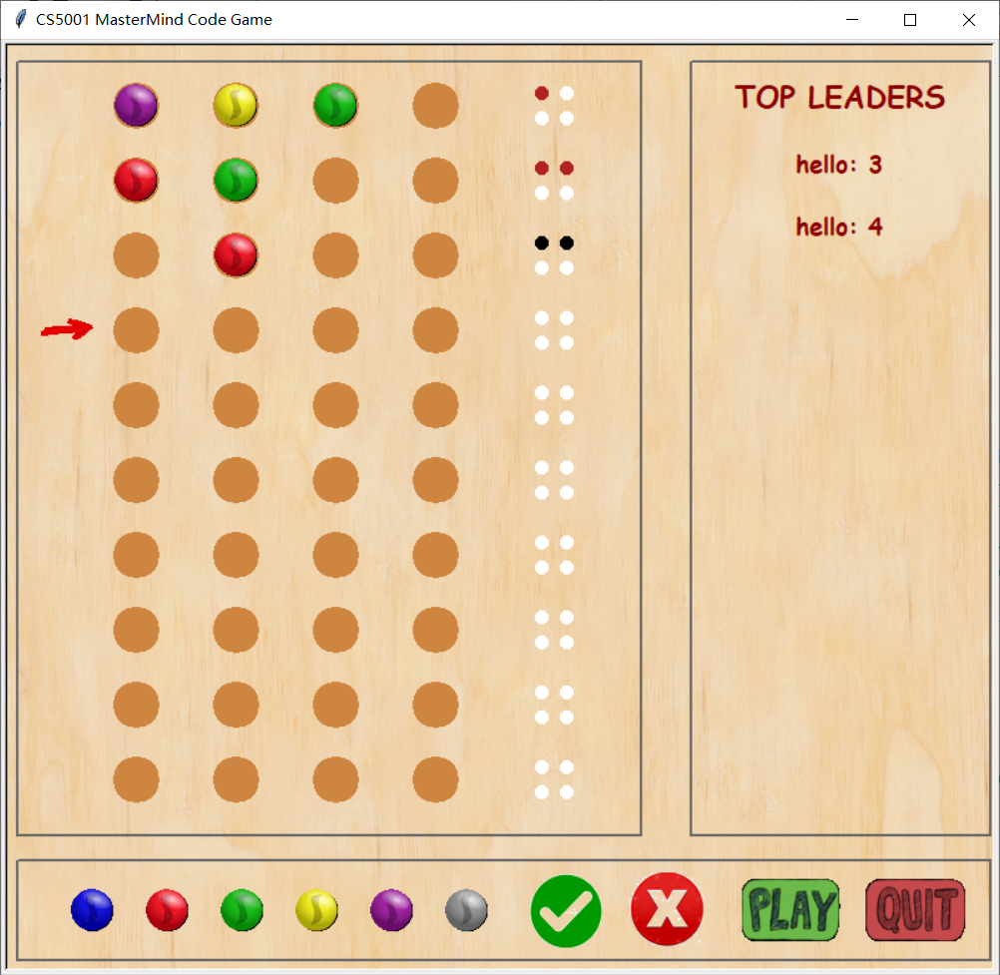

# Mastermind Boardgame

 

## About the Project
*Mastermind* is a coding-breaking board game for two players. The “secret code” is a set of 4 colors chosen out of a possible 6 colors, where the player needs to guess which colors are in which positions in the 4-color secret code. After each guess, the player learns how many colors in their guess are in the right position, and how many had a color that’s in the code but the color is in the wrong position. Scoring pegs of different colors were used to show them how many correct guesses and how many correct positions they had gotten with their guess. Red pegs meant a correct color but out of position, black pegs meant a correct color in the correct position. These scoring pegs after each guess can be placed in any order – the player never knows which colors are correct and/or in the correct position. Examples of the two-player version of the game being played can be seen.

This project is a one-player version game. The program selects the 4-color secret code from 6 colors, and the player must guess the colors and their positions by clicking or draging the corresponding marbles. Noted that the duplicate colors and empty spot are allowed in this game.

## Project Design
This program uses the Objected Oriented Programming and the MVC architecture. It contains three main classes: GameModel, Controller, and Board.

- GameModel: the Model part implements all the game functionality following the Controller's directives.

- Controller: the Controller part takes user input from the Board; tells the Model what to do and the Controller what to display; communicates between the Board and the Model.

- Board: the View part comprises one superclass Board and several subclasses, such as Marble, LeaderBoard, Check, etc. The Board class is in charge of the user display and user interaction.
